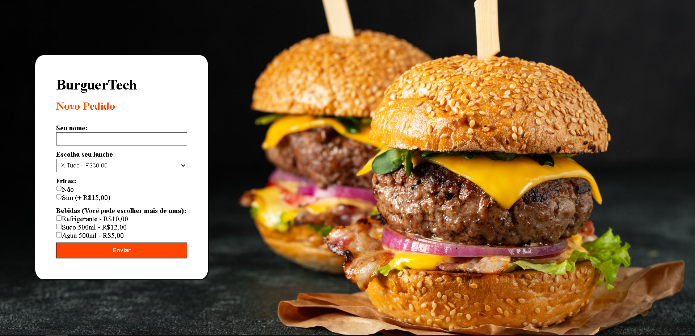
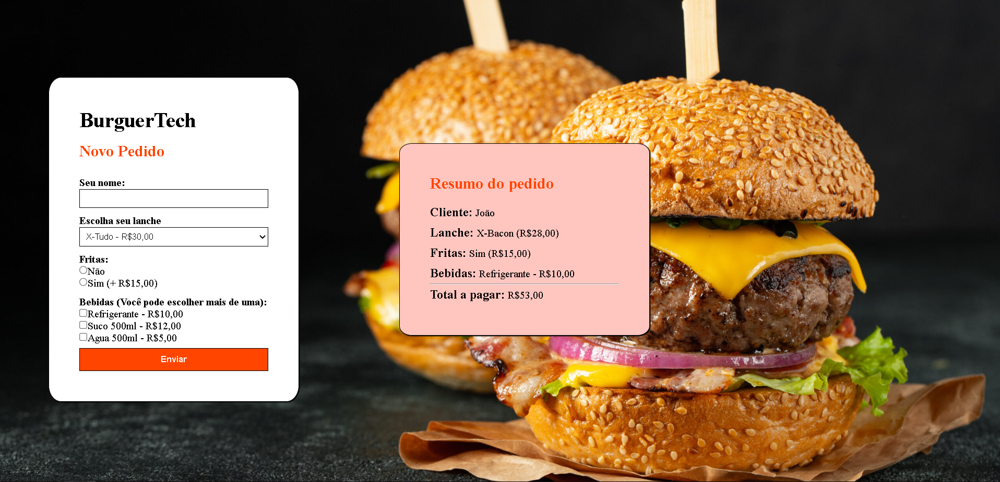

#  BurguerTech

Projeto desenvolvido para a disciplina de **Desenvolvimento Web  2** com a professora *Eulaliane Aparecida Goncalvez*.  
O objetivo foi criar uma tela de menu de uma lanchonete utilizando **HTML e CSS** para o layout, e **PHP** para receber os dados do formulário e exibir o resumo do pedido junto com os valores.

---

##  Imagens do Projeto

### Tela de Pedido

### Resumo do Pedido

---

##  Tecnologias Utilizadas
- **HTML5** → Estrutura da página  
- **CSS3** → Estilização  
- **PHP** → Processamento e exibição dos dados do pedido  

---

## Funcionalidades
 Formulário com:
- Input de texto para nome  
- Select para escolher o lanche  
- Radio buttons para escolher batata frita  
- Checkbox para selecionar bebidas  

Ao enviar o formulário:
- O PHP recebe as informações  
- Exibe o resumo do pedido  
- Calcula e mostra o **valor total**

---

